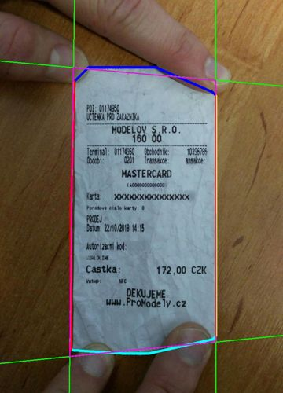

# Segmentace účtenky ve fotografii

> Ročníkový projekt, LS 2019 Jiří Mayer

[Specifikace projektu](specification/2019-02-25.pdf)

## Spuštění

Pro běh je potřeba `python3` s knihovnami `numpy` a OpenCV `cv2`.

Program se spustí příkazem z kořenové složky repozitáře:

    python3 -m app

Program čte soubory z datasetu, na každém provede segmentaci a výsledky uloží do složky `/out`.

[Více o struktuře datasetu](docs/dataset.md)

## Jak segmentace probíhá

1) Získáme cílovou distribuci pixelů
    - Uživatel vymezí obdélníkovou oblast na fotce, kde leží účtenka
    - V současné chvíli je oblast uložená v datasetu
2) Posouváním okénka napočítáme distribuce pixelů po celé fotografii
3) Spočítáme vzdálenost lokálních distribucí od cílové distribuce
4) Na vzniklou vzdálenostní mapu použijeme algoritmus MSER pro detekci souvislých oblastí
    - Oblast s nejnižší vzdáleností je oblast odpovídající účtence
5) Okolo oblasti umístíme čtyřúhelník

## Ještě potřebuji vyřešit

- Převést výsledný mnohoúhelník na čtyřúhelník
- Automaticky získat cílovou distribuci pixelů a ne ji vyčíst z datasetu
- Proč selhávají příklady `011.jpg` a `012.jpg`, přestože mají kontrastní pozadí
